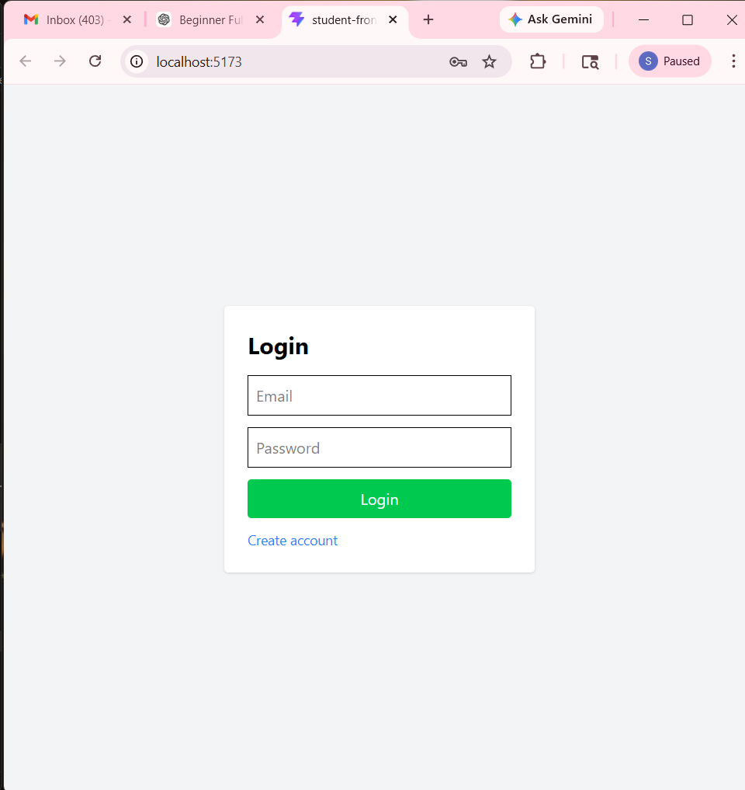
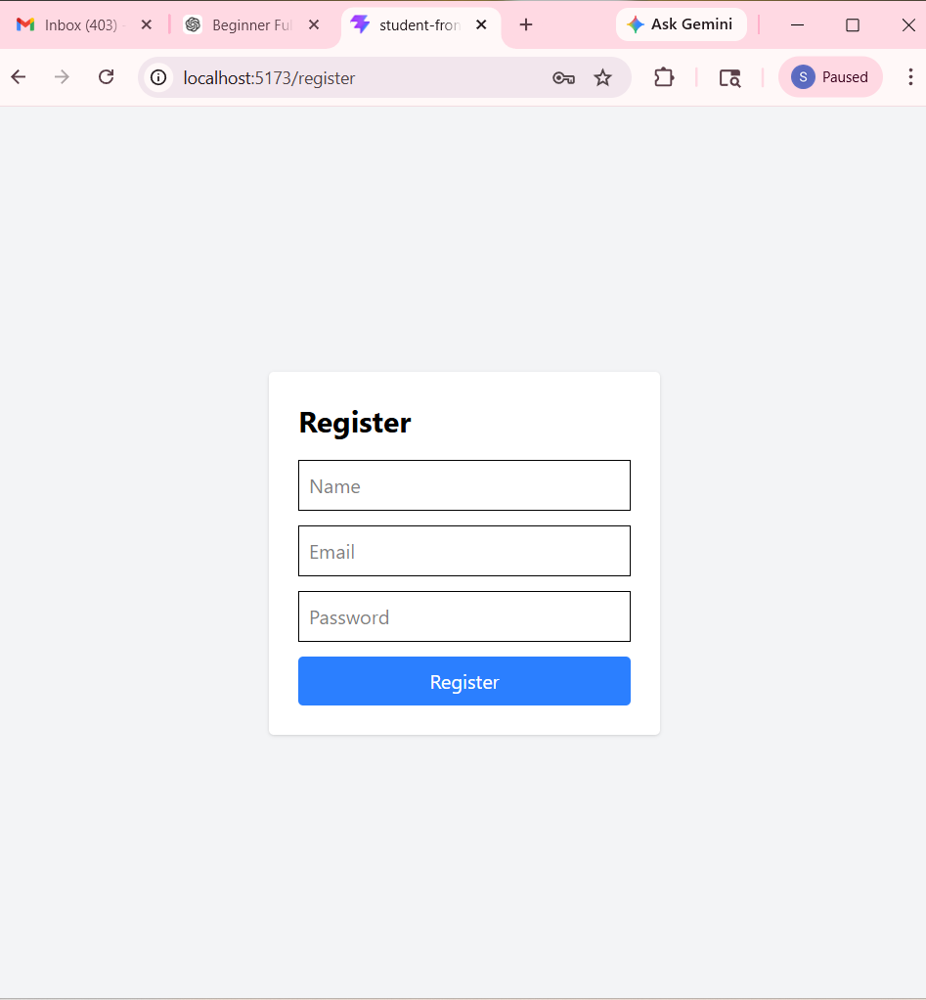
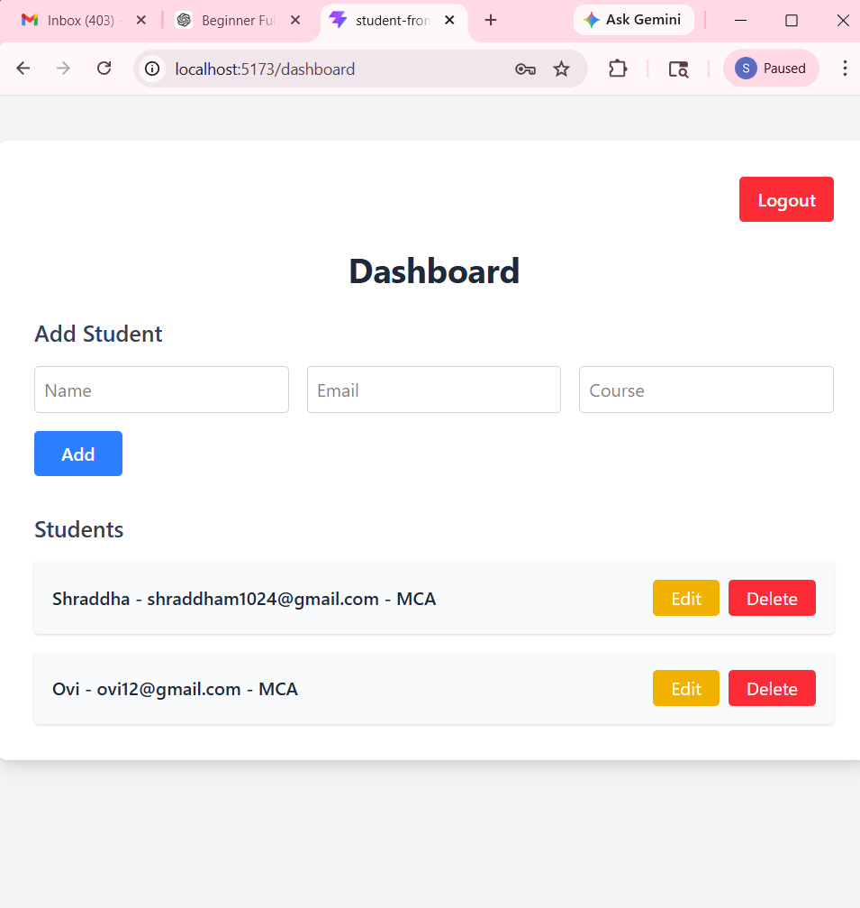
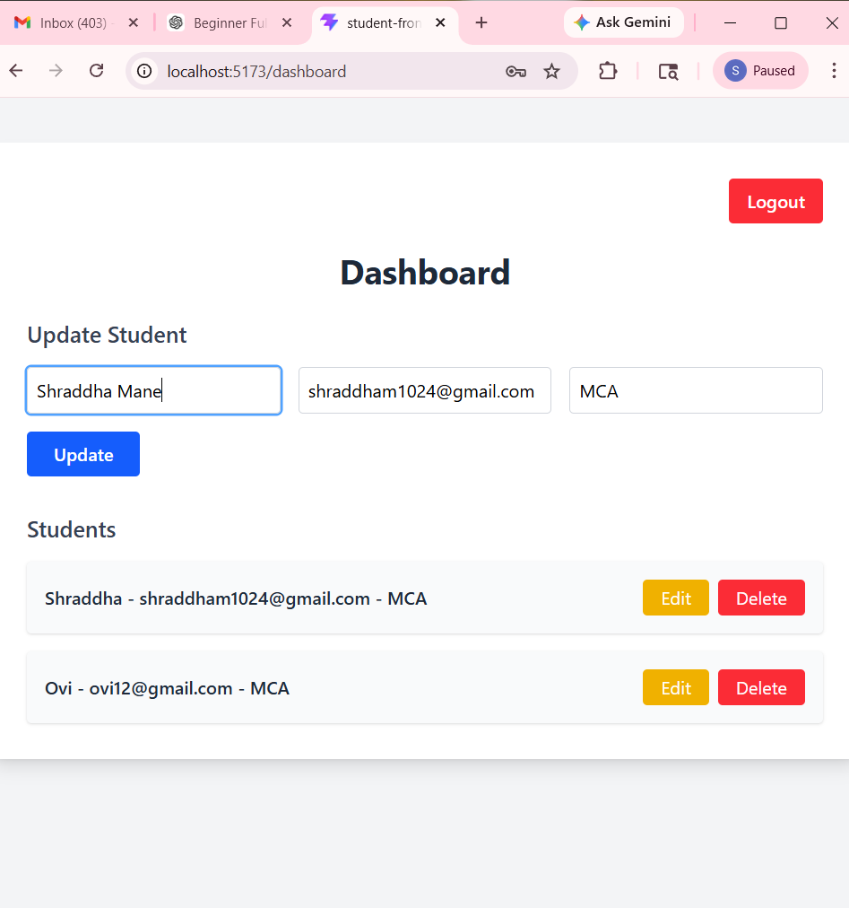

# Student Management System - Frontend

React frontend for Student Management System with authentication and student CRUD operations.

## Features

### Authentication
- Login Page
- Register Page
- Logout
- Protected Dashboard

### Student Management
- Add Student
- View Students
- Update Student
- Delete Student

---

## Tech Stack

- React
- React Router DOM
- Axios
- Tailwind CSS
- Vite

---

## Project Structure

```
src
 ├── pages
 │   ├── Login.jsx
 │   ├── Register.jsx
 │   └── Dashboard.jsx
 │
 ├── api.js
 ├── ProtectedRoute.jsx
 ├── App.jsx
 └── main.jsx
```

---

## API Configuration

Backend base URL is configured in:

```
src/api.js
```

```
baseURL: "http://localhost:8080"
```

Change this when deploying backend.

---

## How to Run

### 1. Install dependencies

```
npm install
```

### 2. Run frontend

```
npm run dev
```

App runs at:

```
http://localhost:5173
```

---

## Pages

- Login Page
- Register Page
- Dashboard
- Student CRUD UI

---

## Backend Requirement

Backend must run on:

```
http://localhost:8080
```

---

## Author

Shraddha Mane

---

## Future Improvements

- Better UI design
- Toast notifications
- Form validation
- Loading spinner
- Role based UI
- Deployment

## Screenshots

### Login Page


### Register Page


### Dashboard


### Update Student

